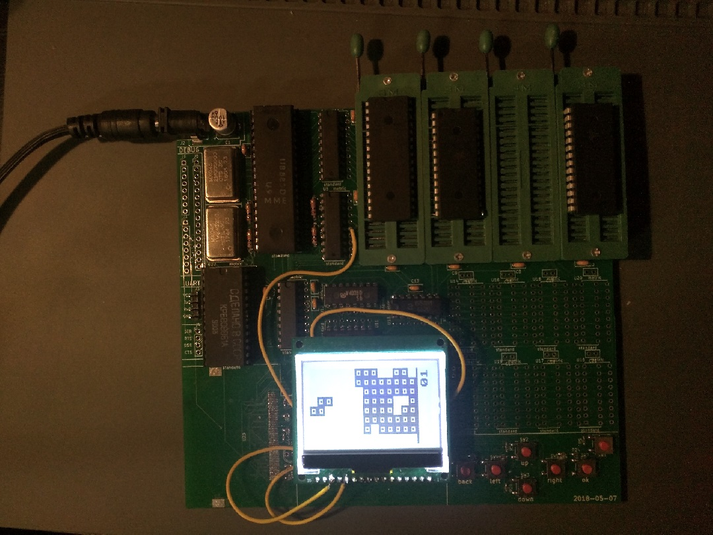

# computer

A microcomputer built from Soviet-era parts.

This repository serves as a place to link to the respositories for the multiple different components involved in the computer's design and construction.

* [computer-hw](https:///github.com/thatoddmailbox/computer-hw): The electrical schematic and PCB layout files, in KiCad and PDF formats.
* [computer-fw](https://github.com/thatoddmailbox/computer-fw): The source code to the computer's firmware, written in Z80 assembly language.
* [computer-emu](https://github.com/thatoddmailbox/computer-emu): An emulator for the computer, written in Go, which allows you to test changes made to the code without needing to go through the annoying process of reprogramming the flash chips.
* [z80asm](https://github.com/thatoddmailbox/z80asm): A custom assembler for the computer, capable of producing Z80 machine code that works with the weird ROM layout of the system.
